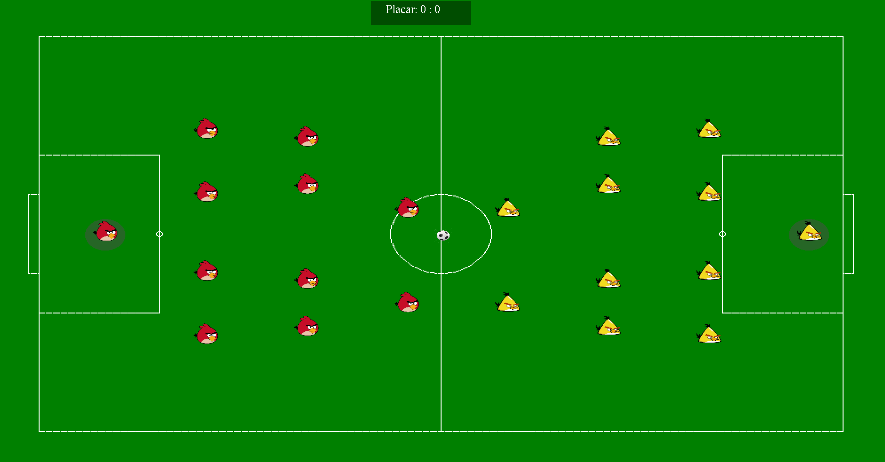

# GoalGL 🌿🏀

GoalGL é um jogo de futebol 2D desenvolvido em C com OpenGL, onde dois times se enfrentam em uma partida animada e nostálgica entre personagens do Angry Birds: **Red** vs **Chuck**. O projeto foi criado como trabalho de Computação Gráfica, utilizando algoritmos de rasterização (como Bresenham), sprites em PNG com transparência e música de fundo.




## 🔹 Proposta de organização do projeto

```
cg-football-opengl/
├── assets/                  # Recursos visuais e sonoros
│   ├── audio/               # Trilhas e efeitos sonoros
│   │   └── soundtrack.mp3
│   ├── ball.png           # Imagem da bola
│   ├── red.png            # Sprite do Red (time 1)
│   └── chuck.png          # Sprite do Chuck (time 2)
│
├── build/                   # Arquivos binários gerados na compilação
│   ├── game_main
│   ├── test_draw
│   ├── test_players
│   └── test_sprites
│
├── include/                 # Headers (.h)
│   ├── audio.h
│   ├── draw.h
│   ├── input.h
│   ├── players.h
│   ├── sprites.h
│   └── stb_image.h
│
├── src/                     # Implementação dos módulos principais
│   ├── audio.c
│   ├── draw.c
│   ├── input.c
│   ├── main.c
│   ├── players.c
│   └── sprites.c
│
├── test/                    # Arquivos de teste independentes
│   ├── test_draw.c
│   ├── test_players.c
│   └── test_sprites.c
│
├── Makefile                 # Script de compilação
├── .gitignore               # Arquivos e pastas ignorados pelo Git
└── README.md                # Documentação do projeto
```

---

## 🔧 Requisitos

Para compilar e rodar o GoalGL, você precisa das seguintes dependências:

### 🎯 Dependências

- **GCC / Clang** (compilador C)
- **Make**
- **OpenGL** (GL, GLU)
- **GLUT** (`freeglut`)
- **FFmpeg** (`ffplay` ou `mpg123` para reprodução de áudio)
- **ImageMagick** (opcional, para edição de PNG)
- **STB Image** (já incluso no projeto)

### 🐿 Instalação em distribuições Linux

#### Manjaro / Arch:

```bash
sudo pacman -S base-devel gcc make freeglut glew ffmpeg mpg123 imagemagick
```

#### Ubuntu / Debian:

```bash
sudo apt update
sudo apt install build-essential libgl1-mesa-dev freeglut3-dev libglew-dev \
             ffmpeg mpg123 imagemagick
```

---

## 🔨 Compilação e Execução

O projeto inclui um `Makefile` para facilitar a compilação. Basta executar:

```bash
make run
./build/game_main
```

Outros alvos também podem estar definidos, como:

```bash
make test_draw
make test_players
make test_sprites
```

O binário final será gerado na pasta `build/`.

---

Se desejar, posso complementar com seções de controles do jogo ou funcionalidades planejadas.

